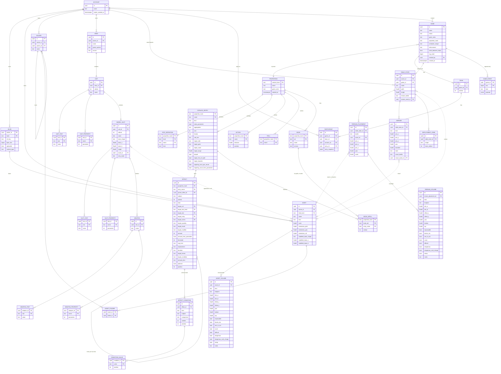

# Schema diagram

Every table of the physical Postgres schema with its columns. [`schema.md`](schema.md) holds the decisions behind
them; [`data-model.md`](data-model.md) is the conceptual view.

```mermaid
erDiagram

    PROPERTIES ||--|{ STAT_DEFINITION : declares
    PROPERTIES ||--|{ CATALOG_ENTRY : catalogs
    PROPERTIES ||--|{ ACTION : names
    PROPERTIES ||--|{ ROLL : names
    CATALOG_ENTRY ||--o{ EFFECT : does
    EFFECT ||--o{ EFFECT : "nests, per success"
    EFFECT ||--o{ EFFECT_CONDITION : "all must hold"
    EFFECT_CONDITION ||--|{ CONDITION_VALUE : ""
    PROPERTIES ||--o{ BOOK : lists
    BOOK ||--o{ BOOK_SPELL : "its spells, in order"
    CATALOG_ENTRY ||--o{ BOOK_SPELL : "listed by"
    GAME }o--|| PROPERTIES : "by hash"
    ACCOUNT ||--o{ BLOB : owns
    ACCOUNT ||--o{ ASSET : owns
    ACCOUNT ||--o{ FOLDER : owns
    ACCOUNT ||--o{ ARMY : owns
    ACCOUNT ||--o{ TABLE_STATE : "saved layouts"
    ACCOUNT ||--o{ PARTICIPANT : "plays as"
    ACCOUNT ||--o{ GAME : created

    BLOB ||--o{ ASSET : bytes
    ASSET ||--o{ ASSET_VOLUME : "terrain profile"
    FOLDER ||--o{ FOLDER : nests
    ASSET ||--o{ ASSET_FOLDER : ""
    FOLDER ||--o{ ASSET_FOLDER : ""

    ARMY ||--|{ UNIT : contains
    UNIT ||--o{ UNIT_STAT : ""
    UNIT ||--o{ UNIT_PROPERTY : ""
    UNIT ||--|{ MODEL_SLOT : contains
    MODEL_SLOT ||--o{ SLOT_STAT : ""
    MODEL_SLOT ||--o{ SLOT_PROPERTY : ""
    MODEL_SLOT ||--o{ WEAPON : loadout
    MODEL_SLOT }o..o| ASSET : "appearance, soft"
    WEAPON ||--o{ WEAPON_STAT : ""
    WEAPON ||--o{ WEAPON_PROPERTY : ""

    TABLE_STATE ||--o{ TERRAIN_PLACEMENT : ""
    TABLE_STATE ||--o{ MARKER : ""
    TABLE_STATE ||--o{ DEPLOYMENT_ZONE : ""
    TABLE_STATE }o..o| ASSET : texture
    TERRAIN_PLACEMENT }o..o| ASSET : "mesh, or a built-in"
    TERRAIN_PLACEMENT ||--o{ TERRAIN_VOLUME : overrides
    MARKER }o..o| ASSET : visual

    GAME ||--|{ TEAM : has
    GAME ||--o| TABLE_STATE : "setup result"
    GAME ||--o{ GAME_EVENT : "append-only"
    TEAM ||--|{ PARTICIPANT : has

    ACCOUNT {
        uuid id PK
        text name
        timestamptz starter_seeded_at
    }
    BLOB {
        uuid owner_id PK
        text hash PK
        text s3_key
        bigint byte_size
        bool uploaded
        text content_type
    }
    ASSET {
        uuid id PK
        uuid owner_id FK
        text blob_hash FK
        text name
        text kind
        float8 scale
        float8 orientation_pitch
        float8 orientation_yaw
        float8 orientation_roll
        text modelled_base_shape
        float8 modelled_base_a
        float8 modelled_base_b
    }
    ASSET_VOLUME {
        uuid id PK
        uuid asset_id FK
        text kind
        text footprint
        float8 dim_a
        float8 dim_b
        float8 offset_x
        float8 offset_y
        float8 yaw
        float8 bottom
        float8 top
        bool impassable
        bool blocks_los
        bool see_in_out
        bool cover
        bool difficult
        bool dangerous
        bool dangerous_rush_charge
        bool steep
        text notes
    }
    FOLDER {
        uuid id PK
        uuid owner_id FK
        uuid parent_id FK
        text name
    }
    ASSET_FOLDER {
        uuid asset_id PK
        uuid folder_id PK
    }
    ARMY {
        uuid id PK
        uuid owner_id FK
        text name
        text game_system
        text source
    }
    UNIT {
        uuid id PK
        uuid army_id FK
        int ordinal
        text name
    }
    UNIT_STAT {
        uuid unit_id PK
        text stat PK
        text value
    }
    UNIT_PROPERTY {
        uuid unit_id PK
        text name PK
        int parameter
    }
    MODEL_SLOT {
        uuid id PK
        uuid unit_id FK
        int ordinal
        text name
        text base_shape
        float8 base_a
        float8 base_b
        float8 height
        uuid asset_id FK
        text army_book
    }
    SLOT_STAT {
        uuid slot_id PK
        text stat PK
        text value
    }
    SLOT_PROPERTY {
        uuid slot_id PK
        text name PK
        int parameter
    }
    WEAPON {
        uuid id PK
        uuid slot_id FK
        text name
    }
    WEAPON_STAT {
        uuid weapon_id PK
        text stat PK
        text value
    }
    WEAPON_PROPERTY {
        uuid weapon_id PK
        text name PK
        int parameter
    }
    TABLE_STATE {
        uuid id PK
        uuid owner_id FK
        uuid game_id FK
        text name
        float8 width
        float8 length
        text texture_builtin
        uuid texture_asset_id FK
    }
    TERRAIN_PLACEMENT {
        uuid id PK
        uuid table_state_id FK
        text builtin
        uuid asset_id FK
        float8 pos_x
        float8 pos_y
        float8 pos_z
        float8 yaw
        float8 scale
    }
    TERRAIN_VOLUME {
        uuid id PK
        uuid terrain_placement_id FK
        text kind
        text footprint
        float8 dim_a
        float8 dim_b
        float8 offset_x
        float8 offset_y
        float8 yaw
        float8 bottom
        float8 top
        bool impassable
        bool blocks_los
        bool see_in_out
        bool cover
        bool difficult
        bool dangerous
        bool dangerous_rush_charge
        bool steep
        text notes
    }
    MARKER {
        uuid id PK
        uuid table_state_id FK
        text kind
        float8 pos_x
        float8 pos_y
        float8 pos_z
        float8 yaw
        float8 diameter
        text label
        text visual_builtin
        uuid visual_asset_id FK
    }
    DEPLOYMENT_ZONE {
        uuid id PK
        uuid table_state_id FK
        text shape
        int team_ordinal
    }
    GAME {
        uuid id PK
        text name
        text status
        text game_rules
        text properties_hash
        text scheduler_shape
        text enforcement
        bool waits_between_steps
        bigint rng_seed
        uuid created_by FK
        timestamptz created_at
    }
    TEAM {
        uuid id PK
        uuid game_id FK
        int ordinal
    }
    PARTICIPANT {
        uuid id PK
        uuid game_id FK
        uuid team_id FK
        uuid account_id FK
        uuid army_id FK
        jsonb army_snapshot
    }
    PROPERTIES {
        text content_hash PK
        text name
        text game_rules
        timestamptz seeded_at
    }
    ACTION {
        text properties_hash PK
        text name PK
        float8 distance
        int position
    }
    BOOK {
        text properties_hash PK
        text uid PK
        text name
        text version
    }
    BOOK_SPELL {
        text properties_hash PK
        text book_uid PK
        text entry_name PK
        int ordinal
    }
    ROLL {
        text properties_hash PK
        text name PK
    }
    STAT_DEFINITION {
        text properties_hash PK
        text level PK
        text name PK
        text kind
    }
    CATALOG_ENTRY {
        text properties_hash PK
        text name PK
        text kind
        bool takes_parameter
        text aggregation
        int cost
        text faction
        text rule_text
        text target_side
        text target_grain
        int target_count
        float8 target_range
        bool played
        bool target_line_of_sight
        text target_requires
        bool targeting_once_per_round
        bool targeting_count_from_parameter
    }
    EFFECT {
        uuid id PK
        text properties_hash FK
        text entry_name FK
        uuid parent_effect_id FK
        text subject
        int ordinal
        text kind
        text target_roll FK
        text target_stat_level FK
        text target_stat FK
        text target_entry FK
        text target_action FK
        text target_quantity
        text target_result
        text target_modifier
        int amount
        bool amount_from_parameter
        int threshold
        text cap_kind
        text replacement
        text duration
        text target_terrain
        text target_condition
        text amount_dice
        bool optional
        int position
    }
    EFFECT_CONDITION {
        uuid id PK
        uuid effect_id FK
        text kind
        text subject
        text comparison
        int number
        int position
    }
    CONDITION_VALUE {
        uuid condition_id PK
        text value PK
        int position
    }
    GAME_EVENT {
        uuid game_id PK
        bigint seq PK
        text kind
        jsonb payload
    }
```
